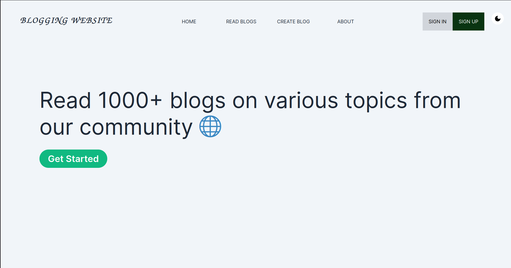

# BLOGSREAD

### Prerequsites

[Node](https://nodejs.org/)

### Project Description

**BLOGSREAD** is a dynamic platform built on the NEXT framework, where users can create and explore blogs from a diverse community of writers. It fosters the sharing of knowledge, ideas, and experiences among readers. The website's efficient rendering and dynamic user interfaces enhance the user experience. Additionally, BLOGSREAD offers Dark Mode, providing users with a visually appealing and comfortable alternative theme for reading and interacting with the content.

### Features Implemented

#### 1. Frontend

1. Home page to see all the blogs
2. Login and SignUp pages for authentication
3. LogOut Route
4. Create Blog route
5. User profile route
6. Light and Dark mode
7. Error and NotFound page
    
   **NOTE:** User Profile route is only accessible for logged in user.

#### 2. Backend

1. Auth Routes
   - Login
   - SignUp
2. User Routes
   - Create a new blog
   - Update the blog
   - Update his credentials

### Technologies and Packages Used

### 1. Frontend

1. Next13
2. Axios
3. Tailwind CSS

#### 2. Backend

1. Node
2. Express
3. MongoDB
4. Mongoose
5. Bcryptjs
6. JsonWebToken

### How to run the project on your local setup

Clone the fronend and backend repositories, cd into both frontend and backend directories individually.

### 1. Frontend

- Fork the frontend repository
- Clone the repository(`git clone`)
- Install the dependencies(`npm insall`)
- Run dev command(`npm run dev`)

### 2. Backend

- Fork the frontend repositry
- Clone the repository(`git clone`)
- Install the dependencies(`npm install`)
- Run start command(`npm run start`)

**NOTE:** Run backend start command before frontend start command.

